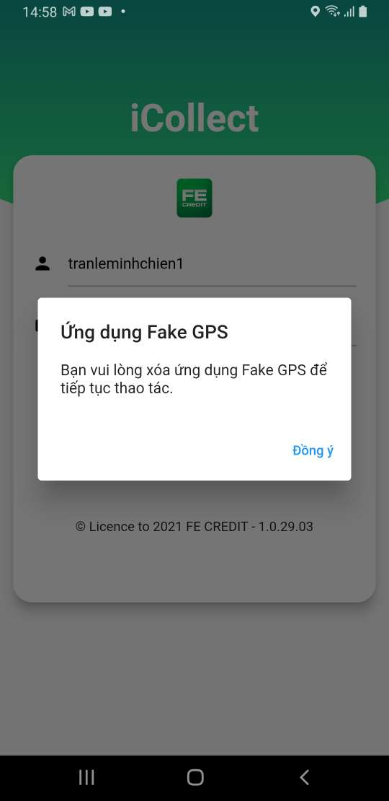

# Package use for
```dart
device_apps
```
### Link to the package: [device_apps](https://pub.dev/packages/device_apps)

## Snippets used to detect fraudulent applications and prevent:
```dart
static Future<bool> detectAppMockLocation(BuildContext context,
      {Function onDetected}) async {
    if (Platform.isAndroid) {
      List<Application> apps = await DeviceApps.getInstalledApplications();
      if (Utils.checkIsNotNull(apps)) {
        if (Utils.isArray(apps)) {
          for (Application app in apps) {
            if (_hasBacklist(app)) {
              WidgetCommon.generateDialogOKCantPop(context,
                  title: 'Ứng dụng Fake GPS',
                  textBtnClose: 'Đồng ý',
                  content: 'Bạn vui lòng xóa ứng dụng ' +
                      app.appName +
                      ' để tiếp tục thao tác.', callback: () async {
                Navigator.of(context).pop();
                onDetected?.call();
              });
              return false;
            }

            for (var mockLocation in mockLocations) {
              if (app.packageName == mockLocation.id &&
                  app.systemApp == false) {
                WidgetCommon.generateDialogOKCantPop(context,
                    title: 'Ứng dụng Fake GPS',
                    textBtnClose: 'Đồng ý',
                    content: 'Bạn vui lòng xóa ứng dụng ' +
                        app.appName +
                        ' để tiếp tục thao tác.', callback: () async {
                  Navigator.of(context).pop();
                  onDetected?.call();
                });
                return false;
              }
            }
          }
        }
      }
    }
    return true;
  }
```

### What apps are on the blacklist
```dart
  MockLocationAppModel(id: "com.blogspot.newapphorizons.fakegps"),
    MockLocationAppModel(id: "com.lexa.fakegpsdonate"),
    MockLocationAppModel(id: "com.rosteam.gpsemulator"),
    MockLocationAppModel(id: "ru.gavrikov.mocklocations"),
    MockLocationAppModel(id: "com.location.test"),
    MockLocationAppModel(id: "com.lkr.fakelocation"),
    MockLocationAppModel(
        id: "com.droid.developer.caller.screen.flash.gps.locator"),
    MockLocationAppModel(id: "com.phonetrackerfree.findmyfamily.gpstracker"),
    MockLocationAppModel(id: "com.mspy.lite"),
    MockLocationAppModel(id: "com.appmaker.userlocation"),
    MockLocationAppModel(
        id: "com.phonenumbertracker.location.mobile.call.locator.callerid"),
    MockLocationAppModel(id: "org.hola.gpslocation"),
    MockLocationAppModel(id: "us.Good4You.NumberLocator"),
    MockLocationAppModel(id: "com.gsmartstudio.fakegps"),
    MockLocationAppModel(id: "com.rosteam.gpsemulator"),
    MockLocationAppModel(id: "com.incorporateapps.fakegps.fre"),
    MockLocationAppModel(id: "com.myplot"),
    MockLocationAppModel(id: "com.locationchanger"),
    MockLocationAppModel(id: "com.fsp.android.phonetracker"),
    MockLocationAppModel(id: "com.virtualmaze.drivingroutefinder"),
    MockLocationAppModel(id: "com.sygic.aura"),
    MockLocationAppModel(
        id: "com.ei.mobilenumberlocator.callerid.mobile.phonenumber.locator"),
    MockLocationAppModel(id: "tat.example.ildar.seer"),
    MockLocationAppModel(id: "com.glympse.android.glympse"),
    MockLocationAppModel(id: "com.gpsroutefinder.locationtracker.free"),
    MockLocationAppModel(id: "com.AndLocation.AndLocation"),
    MockLocationAppModel(id: "com.itbrickworks.geoposition"),
    MockLocationAppModel(id: "com.driving.directions.satellite.location.map"),
    MockLocationAppModel(id: "com.theappninjas.fakegpsjoystick"),
    MockLocationAppModel(id: "com.fundoapps.gpsmappaid"),
    MockLocationAppModel(id: "police.speed.gps.antiradar"),
    MockLocationAppModel(id: "com.evezzon.fakegps"),
    MockLocationAppModel(id: "com.lexa.fakegps"),
    MockLocationAppModel(id: "com.incorporateapps.fakegps.fre"),
    MockLocationAppModel(id: "com.just4funtools.fakegpslocationprofessional"),
    MockLocationAppModel(id: "com.gsmartstudio.fakegps"),
    MockLocationAppModel(id: "com.theappninjas.fakegpsjoystick"),
    MockLocationAppModel(id: "com.fly.gps"),
    MockLocationAppModel(id: "com.pe.fakegpsrun"),
    MockLocationAppModel(id: "com.evezzon.fakegps"),
    MockLocationAppModel(id: "com.g_c.fakesnapmap"),
    MockLocationAppModel(id: "com.locationchanger"),
    MockLocationAppModel(id: "com.phongphan.fakegps"),
    MockLocationAppModel(id: "com.ninja.toolkit.pulse.fake.gps.pro"),
    MockLocationAppModel(id: "com.lexa.fakegpsdonate"),
    MockLocationAppModel(id: "com.marlon.floating.fake.location"),
    MockLocationAppModel(id: "ru.gavrikov.mocklocations"),
    MockLocationAppModel(id: "com.fakegps.fakelocation"),
    MockLocationAppModel(id: "com.incorporateapps.fakegps_route"),
    MockLocationAppModel(id: "com.lkr.fakelocation"),
    MockLocationAppModel(id: "com.electro_tex.fakegpslocation"),
    MockLocationAppModel(id: "com.rosteam.gpsemulator"),
    MockLocationAppModel(id: "com.neogulabs.fakegps"),
    MockLocationAppModel(id: "com.incorporateapps.fakegps"),
    MockLocationAppModel(id: "com.xdoapp.virtualphonenavigation"),
    MockLocationAppModel(id: "com.pe.fakegps"),
    MockLocationAppModel(id: "com.app.fake.gps"),
    MockLocationAppModel(id: "com.kfn.fakegpsfree"),
    MockLocationAppModel(id: "com.ltp.pro.fakelocation"),
    MockLocationAppModel(id: "com.fakegps.joystick"),
    MockLocationAppModel(id: "project.listick.fakegps"),
    MockLocationAppModel(id: "com.ua.eugenezaychenko.mocklocations"),
    MockLocationAppModel(id: "tk.kureksofts.fakegps"),
    MockLocationAppModel(id: "com.fakegps.fakelocation.fakegps"),
    MockLocationAppModel(id: "fake.gps.location"),
    MockLocationAppModel(id: "com.technoviral.fakelivelocation"),
    MockLocationAppModel(id: "fr.dvilleneuve.lockito"),
    MockLocationAppModel(id: "com.adaptivebits.fakegpslocation"),
    MockLocationAppModel(id: "pt.com.turnersark.fakegpsfulllocationpro"),
    MockLocationAppModel(id: "com.electro_tex.fakegpsgo"),
    MockLocationAppModel(id: "fakegps.fakegpslocation"),
    MockLocationAppModel(id: "net.xnano.android.gpsfakerunning"),
    MockLocationAppModel(id: "net.marlove.mockgps"),
    MockLocationAppModel(id: "net.tkgjamukeliling.geskit"),
    MockLocationAppModel(id: "br.com.tupinikimtecnologia.fakegpslocation"),
    MockLocationAppModel(id: "com.joyend.jumloc"),
    MockLocationAppModel(id: "com.fakegps.gps.go.pro"),
    MockLocationAppModel(id: "com.mobile.gpsloc"),
    MockLocationAppModel(id: "com.electro_tex.fakegps"),
    MockLocationAppModel(id: "com.boolyhuman.fakegps"),
    MockLocationAppModel(id: "gp.com.turnersark.fakegpspaid"),
    MockLocationAppModel(
        id: "com.ka.fakegps.flygps.locationchanger.mocklocation.fakegpslocation"),
    MockLocationAppModel(id: "com.lapacadevs.gpsfaker"),
    MockLocationAppModel(id: "com.idans.locationfaker"),
    MockLocationAppModel(id: "com.exien.fakegps"),
    MockLocationAppModel(id: "a1brains.com.fakegps"),
    MockLocationAppModel(id: "com.divi.fakeGPS"),
    MockLocationAppModel(id: "lame.game.fakeGPS"),
    MockLocationAppModel(id: "com.frastan.fakegps"),
    MockLocationAppModel(id: "fakelocation.app.haoxiang.fakelocation"),
    MockLocationAppModel(id: "com.sigma.delta.fake.gps.near.by.places"),
    MockLocationAppModel(id: "com.lookie.fakegps"),
    MockLocationAppModel(id: "com.fake.gps.location.tracker.map"),
    MockLocationAppModel(id: "com.threee.mobile.mock.location"),
    MockLocationAppModel(id: "de.locationchanger.fakegps"),
    MockLocationAppModel(id: "com.str.mor.mockloc"),
    MockLocationAppModel(id: "com.maxisystem.fakelivelocation"),
    MockLocationAppModel(id: "com.msl.worldtroll"),
    MockLocationAppModel(id: "com.lovestyle.mapwalker.android"),
    MockLocationAppModel(id: "com.fakegps.location.changer"),
    MockLocationAppModel(id: "yaacode.android.gps.movegps.free"),
    MockLocationAppModel(id: "com.kfn.flygpspro"),
    MockLocationAppModel(id: "com.arabapps.fakegps"),
    MockLocationAppModel(id: "com.ngapp.fakegps"),
    MockLocationAppModel(id: "com.ctappmaker.fakegpswithjoystick"),
    MockLocationAppModel(id: "com.plusinfosys.fakegpslocation"),
    MockLocationAppModel(id: "com.ta.My.Fake.Location.Fake.GPS"),
    MockLocationAppModel(id: "havefunapps.tilttofakegpslocation"),
    MockLocationAppModel(id: "nd.conectudo.top"),
    MockLocationAppModel(id: "com.blk.fakegpspro"),
    MockLocationAppModel(id: "com.clebsonsystem.fakelivelocation"),
    MockLocationAppModel(id: "com.blk.fakegps"),
    MockLocationAppModel(id: "com.bigbistudio.flygps"),
    MockLocationAppModel(id: "com.safisoft.fakelocation_duckgps"),
    MockLocationAppModel(id: "br.com.eyetech.fakegpslocation"),
    MockLocationAppModel(id: "com.blackkara.mockation"),
    MockLocationAppModel(id: "com.diwa.sogps"),
    MockLocationAppModel(id: "com.tistory.maxxgreen.app.virtuallocation"),
    MockLocationAppModel(id: "tk.kureksofts.fakegpsvip"),
    MockLocationAppModel(id: "br.com.itexpertconsult.changemygps"),
    MockLocationAppModel(id: "com.favorite.pro.fakegpslocation"),
    MockLocationAppModel(id: "com.studio.armens.fakelocation"),
    MockLocationAppModel(id: "com.gstavrinos.fake_gps_movement"),
    MockLocationAppModel(id: "com.tl.Fake.fakelocation.changeyourlocation"),
    MockLocationAppModel(id: "com.project.jp.fakegpsgo"),
    MockLocationAppModel(id: "com.vishavraj.fakegpslocation"),
    MockLocationAppModel(id: "yaacode.android.gps.movegps.premium"),
    MockLocationAppModel(id: "com.selahaddinerdogan.fakegpssocial"),
    MockLocationAppModel(id: "de.appsmadeingermany.gpsfakelocation"),
    MockLocationAppModel(id: "com.delvedapps.fakegpscontroller"),
    MockLocationAppModel(id: "com.homestudio.fake.gps.location.pro"),
    MockLocationAppModel(id: "org.remdev.fakegps"),
    MockLocationAppModel(id: "com.intelligence.flygps"),
    MockLocationAppModel(id: "com.trinus.faketrack"),
    MockLocationAppModel(id: "com.isocial.fakelocation"),
    MockLocationAppModel(id: "com.skibapps.fakehotspotdetector"),
    MockLocationAppModel(id: "com.pokemod.velocity"),
    MockLocationAppModel(id: "com.binarygraft.pokewalk"),
    MockLocationAppModel(id: "ru.gavrikov.hidemocklocations"),
    MockLocationAppModel(id: "com.location.test"),
    MockLocationAppModel(id: "com.intelligence.flyfakegpspro"),
    MockLocationAppModel(id: "com.loca.mockpos"),
    MockLocationAppModel(id: "nz.pbomb.xposed.spoofmydevice"),
    MockLocationAppModel(id: "com.diwa.detector.mock"),
    MockLocationAppModel(id: "com.tmsoft.mocklocation"),
    MockLocationAppModel(id: "com.digrasoft.mygpslocation"),
    MockLocationAppModel(id: "com.mocker.mockloc"),
    MockLocationAppModel(id: "com.bomerapps.movablemockgps"),
    MockLocationAppModel(id: "de.renewahl.switchgps"),
    MockLocationAppModel(id: "github.luv.mockgeofix"),
    MockLocationAppModel(id: "com.clockwk.GPSAntiSpoof"),
    MockLocationAppModel(id: "com.parallelaxiom.fyl"),
    MockLocationAppModel(id: "com.bratin.easymocklocation"),
    MockLocationAppModel(id: "com.freemium.android.apps.gps.coordinates"),
    MockLocationAppModel(id: "com.ex.jo.jogpstracking"),
    MockLocationAppModel(id: "com.narkira.gpslocation"),
    MockLocationAppModel(id: "com.rayo.savecurrentlocation"),
    MockLocationAppModel(id: "com.clockwk.GPSAntiSpoofPro"),
    MockLocationAppModel(id: "com.androidlab.gpsfix"),
    MockLocationAppModel(id: "com.mysticmobileapps.gps.location"),
    MockLocationAppModel(id: "com.brianbhuang.fakelocation"),
    MockLocationAppModel(id: "mobi.coolapps.locationsimulator"),
    MockLocationAppModel(id: "net.gamemud.fakegps"),
    MockLocationAppModel(id: "com.eomsbd.falselocation"),
    MockLocationAppModel(
        id: "com.maps.voice.navigation.traffic.gps.location.route.driving.directions"),
    MockLocationAppModel(id: "police.speed.gps.antiradar"),
    MockLocationAppModel(id: "de.p72b.mocklation"),
    MockLocationAppModel(id: "de.mobileconcepts.cyberghost"),
    MockLocationAppModel(id: "com.imaptools.locationchangertracker"),
    MockLocationAppModel(id: "eu.chylek.adam.fakewifi"),
    MockLocationAppModel(id: "com.software.amen789.fakemap"),
    MockLocationAppModel(id: "geo.location.tracker.and.editor"),
    MockLocationAppModel(id: "com.zsan605.fake_location"),
    MockLocationAppModel(id: "com.crazyapps.mobilelocationtracker"),
    MockLocationAppModel(id: "luo.gpsspeed"),
    MockLocationAppModel(id: "com.nordvpn.android"),
    MockLocationAppModel(id: "com.GPS_Faker.dsm_029.pokemonicstate"),
    MockLocationAppModel(id: "com.kochini.android.locationmarker")
```

### screenshots:

